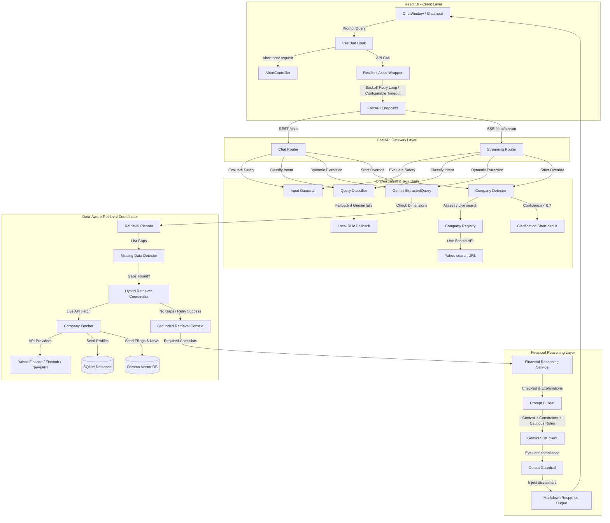
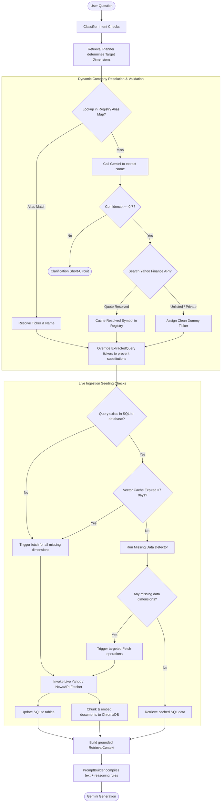

# MoneyLogix Stock AI Assistant — System Architecture & Documentation

The **MoneyLogix Stock AI Assistant** is a resilient, data-aware equity research chatbot. It combines a FastAPI backend and a React/Vite/Tailwind frontend with a **Data-Aware Retrieval Pipeline**, a **Financial Reasoning Layer**, and a **Dynamic Company Ticker Resolver**. It allows users to ask financial evaluation, strength, and valuation questions about any listed company, fetching missing data live from Yahoo Finance/NewsAPI, evaluating checklists, and answering cautiously without issuing investment recommendations.

---

## 1. System Architecture Diagram

Below is the complete end-to-end data flow and component diagram:



### Complete Data Retrieval & Ingestion Flow

Below is the detailed step-by-step logic map for company detection, unlisted resolution, database verification, dynamic API fetching, and grounded context construction:



---

## 2. Core Components Specification

### A. Frontend Layer (React/Vite/Tailwind)
- **`Home.jsx` & `ChatWindow.jsx`**: Coordinates message threads, suggestions chips, error banners, and the new **Retry** trigger button.
- **`ChatInput.jsx`**: Handles multiline auto-resizing textarea input and renders an animated rotating SVG loading spinner inside the submit button when a query is pending.
- **`useChat.js` Hook**: Manages UI state, captures abort reference hooks (`AbortController`), and maps Axios timeouts to clear, friendly user warnings (*"The request is taking longer than expected. Please try again in a moment."*).
- **`api.js` Axios Wrapper**: Utilizes configurable timeouts (`VITE_API_TIMEOUT`) and a retry loop that executes up to 3 times with exponential backoff on transient network drops or timeouts.

### B. Gateway & Orchestrator Layer (FastAPI & Gemini AI)
- **FastAPI Endpoints (`app/api/chat.py`)**: Hosts `/chat` for normal REST JSON payloads and `/chat/stream` Server-Sent Events (SSE) for real-time word token streams.
- **Input & Output Guardrails (`input_guardrail.py`, `output_guardrail.py`)**: Intercepts toxic or unsafe prompts, runs confidence evaluation heuristics, and ensures programmatic disclaimers are present.
- **Query Classifier (`query_classifier.py`)**: Determines query intent (Valuation, News, Filings, etc.) to optimize search routing. If Gemini disconnects or hits rate limits, a rule-based **Local Fallback Classifier** executes keyword regex matching to avoid failing.
- **Company Ticker Resolver (`company_registry.py` & `company_detector.py`)**:
  - Uses local known alias matches first.
  - Falls back to a live Yahoo Finance HTTP search endpoint (`https://query2.finance.yahoo.com/v1/finance/search`) to dynamically discover base symbols for unlisted companies (e.g. Nestle India $\rightarrow$ `NESTLEIND`).
  - Registers private companies (e.g. Haldiram $\rightarrow$ `HALDIRAM`) with dummy tickers to prevent incorrect substitutions or default overrides.
  - If a company cannot be identified (detection confidence $< 0.7$), it immediately returns a clarification request.

### C. Data-Aware Retrieval & Ingestion Layer
- **Missing Data Detector (`missing_data_detector.py`)**: Maps queries to data requirements (Current Metrics, Profile Metadata, 5-Year History, Payout Dividends, Filings, News) and queries SQLite and ChromaDB to verify what tables are empty.
- **Seeding Coordinator (`hybrid_retriever.py`)**: On database cold starts or cache expiration, calls target provider methods (`Yahoo Finance`, `Finnhub`, `NewsAPI`), writes profiles/dividends to SQLite, embeds report chunks to ChromaDB, and performs a retrieval retry.
- **Resilient AI Client (`ai_service.py`)**: Uses a client decorator wrapper to intercept rate limits (`HTTP 429`), timeouts, and transient server errors (`HTTP 500 / 503 Service Unavailable`), applying backoff retry delays.

### D. Financial Reasoning Layer (`financial_reasoning_service.py`)
- Maps query categories (Valuation, Growth, Profitability, Risk, Liquidity, Dividend) to checklist metrics:
  - **Valuation**: `pe_ratio`, `pb_ratio`, `peg_ratio`, `industry_pe`, `historical_pe`
  - **Growth**: `revenue_growth`, `profit_growth`, `eps_growth`, `operating_margin`
  - **Profitability**: `roe`, `roce`, `operating_margin`, `net_margin`
  - **Dividend**: `dividend_history`, `dividend_yield`, `dividend_payout_ratio`
  - **Risk**: `debt_to_equity`, `interest_coverage`, `current_ratio`
  - **Liquidity**: `current_ratio`, `quick_ratio`, `working_capital`
- Scans `RetrievalContext` to generate checklists of available vs. missing metrics, along with their financial descriptions.
- Passes constraints to the **Prompt Builder** enforcing cautious language (*suggests*, *appears*, *could imply*) and programmatically appends standard disclaimers.

---

## 3. Storage Schema Layout

### A. SQLite Tables (Core Financials & Metadata)
- **`companies`**:
  - Ticker (Primary Key), Name, Sector, Industry, CEO, Headquarters, Listing Exchange, Website, Country, Competitors list.
  - Core metrics: `revenue`, `profit`, `eps`, `pe_ratio`.
- **`company_financial_history`**:
  - Ticker, Year, Revenue, Profit, EPS, Operating Margin %, Net Margin %, ROE %, ROCE %, Dividend.
- **`company_dividends`**:
  - Ticker, Declaration Date, Payout Dividend Amount (Rs.), Dividend Yield %.

### B. ChromaDB (Vector Collections)
- **`financial_documents`**: Persists processed, chunked paragraphs of annual reports, earnings call transcripts, and corporate 10-K filings.
- **`financial_news`**: Stores recent news feed headlines, publication timestamps, and summary snippets.

---

## 4. Run & Test Instructions

### Backend Setup
1. Navigate to `/stock-ai/backend`.
2. Configure configuration environment variables in `.env` (refer to `.env.example`).
3. Start the FastAPI development server:
   ```bash
   venv/bin/uvicorn app.main:app --reload
   ```

### Frontend Setup
1. Navigate to `/stock-ai/frontend`.
2. Compile and run Vite development server:
   ```bash
   npm run dev
   ```

### Running Test Suites
- **Company Detection Checks**:
  ```bash
  venv/bin/python scratch/test_company_detection.py
  ```
- **Financial Routing Suite**:
  ```bash
  venv/bin/python scratch/test_routing.py
  ```
- **Data-Aware Pipeline Verification**:
  ```bash
  venv/bin/python scratch/verify_data_aware.py
  ```
- **Reasoning Layer Logic Verification**:
  ```bash
  venv/bin/python scratch/verify_reasoning.py
  ```
